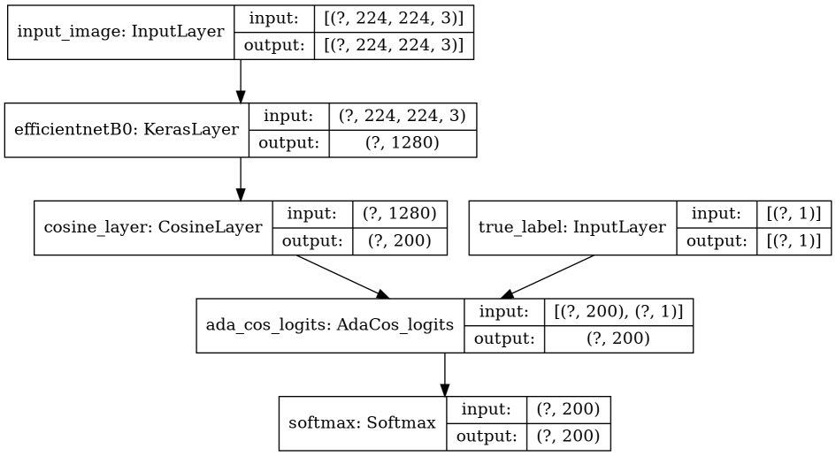

# Keras Custom Layers of AdaCos and ArcFace

Keras implementation of Adacos, ArcFace and l2-softmax and experiments in caltech_birds2011.

## Original Paper

* AdaCos: Adaptively Scaling Cosine Logits for Effectively Learning Deep Face Representations<br>
    [https://arxiv.org/abs/1905.00292](https://arxiv.org/abs/1905.00292)
* ArcFace: Additive Angular Margin Loss for Deep Face Recognition<br>
    [https://arxiv.org/abs/1801.07698](https://arxiv.org/abs/1801.07698)
* L2-constrained Softmax Loss for Discriminative Face Verification<br>
    [https://arxiv.org/abs/1703.09507](https://arxiv.org/abs/1703.09507)

## Building Model sample by the Functional API

```python
from CustomLayer import AdaCos
feature_extractor_layer = hub.KerasLayer("https://tfhub.dev/tensorflow/efficientnet/b0/feature-vector/1", name='efficientnetB0')
input_image = tf.keras.Input(shape=(img_size, img_size, 3), dtype=tf.float32, name='input_image')
efficientnet_output = feature_extractor_layer(input_image)

cos_layer = CosineLayer(num_classes=num_classes)
cos_layer_output = cos_layer(efficientnet_output)

logits = AdaCos_logits()([cos_layer_output, y_true])

model = tf.keras.models.Model(inputs=(input_image, y_true), outputs=tf.keras.layers.Softmax()(logits)
```



## Input tf.data shape

```python
train_batches.element_spec
```

```shell-session
((TensorSpec(shape=(None, None, None, 3), dtype=tf.float32, name=None), TensorSpec(shape=(None, 1), dtype=tf.int64, name=None)), TensorSpec(shape=(None,), dtype=tf.int64, name=None))
```

## Requirements

* tensorflow > 2.2

## Experiments in caltech_birds2011

experiment_caltech_birds.py